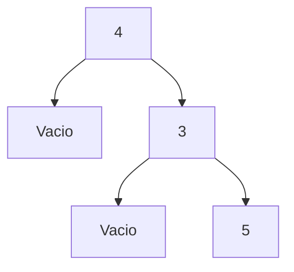

# Práctica 06 - Árboles Binarios

**Universidad Nacional Autónoma de México**
**Facultad de Ciencias**
**Semestre:** 2026-II
**Materia:** Estructuras Discretas

**Profesor:** Rafael Reyes Sánchez
**Ayudante de Teoría:** Daniel Rojo Mata
**Ayudante de Laboratorio:** Irvin Javier Cruz González

---

##  Descripción

En esta práctica se implementan operaciones recursivas sobre árboles binarios en Haskell utilizando un tipo de dato algebraico. Además, se realizan representaciones gráficas con Mermaid y se validan las funciones mediante pruebas unitarias.

El tipo de dato base utilizado es:

```haskell
data Arbol a = Vacio | AB a (Arbol a) (Arbol a) deriving (Eq, Ord, Show)
```

---

##  Objetivo

Implementar funciones recursivas que operen sobre árboles binarios, comprender su estructura y aplicar recorridos, verificaciones y transformaciones.


## Funciones Implementadas

1. **nVacios**
   Cuenta el número de nodos vacíos en un árbol.

2. **refleja**
   Intercambia recursivamente los subárboles izquierdo y derecho.

3. **mínimo o máximo**
   Obtiene el valor mínimo o máximo del árbol.

4. **recorrido**
   Genera una lista con alguno de los recorridos:

   * InOrden
   * PreOrden
   * PostOrden

5. **esBalanceado**
   Verifica si un árbol binario está balanceado.

6. **listaArbol**
   Construye un árbol binario de búsqueda a partir de una lista.

---

##  Representaciones con Mermaid

Se generaron representaciones gráficas de árboles binarios usando Mermaid dentro del README correspondiente.

Ejemplo:



---

## Pruebas Unitarias

Para ejecutar las pruebas unitarias se utilizó:

```bash
runhaskell practica6_test.hs
```

Las etiquetas obtenidas son:

* **Cases** → Número total de pruebas
* **Tried** → Pruebas ejecutadas
* **Errors** → Errores en ejecución
* **Failures** → Resultados incorrectos

Se espera que todas las pruebas pasen correctamente.

---

## Consideraciones

* Todas las funciones fueron implementadas de forma recursiva
* Se utilizaron módulos auxiliares cuando fue necesario
* No se utilizaron:

  * foldr
  * foldl
  * maximum
  * minimum
* Cada función contiene comentarios explicativos

---

##  Tiempo de Desarrollo

Aproximadamente 7 horas.

---

## Material de Consulta

* Mermaid para árboles
* Recursión en árboles
* Repositorio oficial del laboratorio

---

##  Licencia

Este proyecto utiliza la licencia MIT. Ver archivo `LICENSE` para más detalles.

---

##  Autora

María Fernanda Barrios Vega
