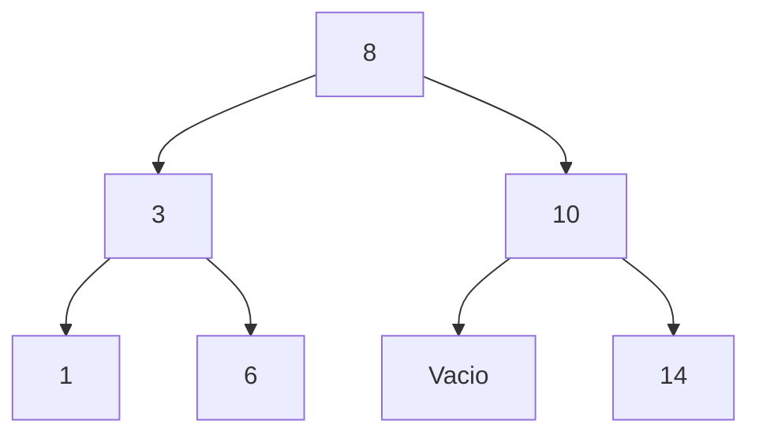
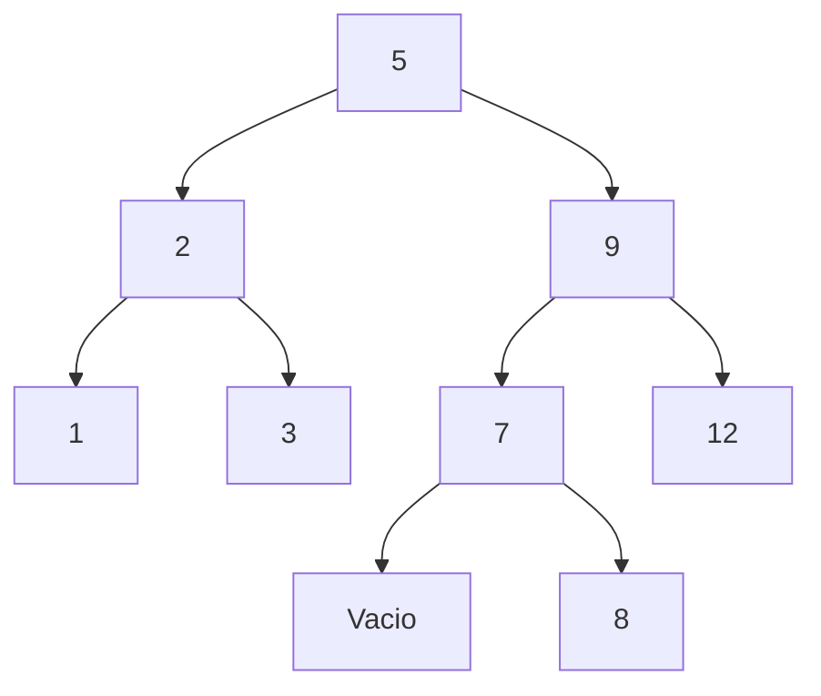
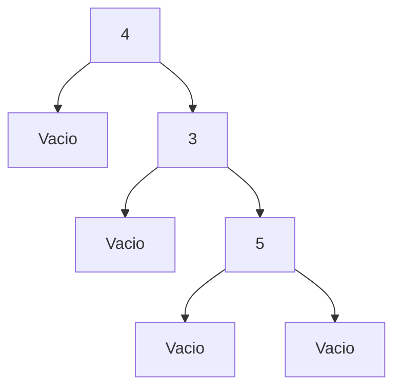
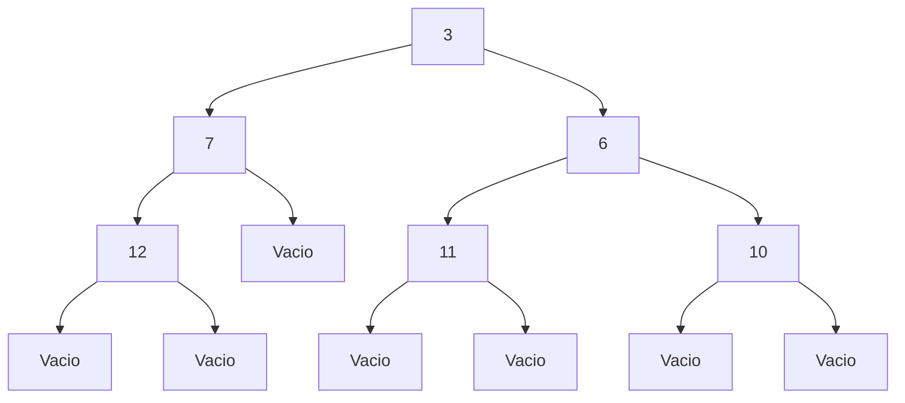
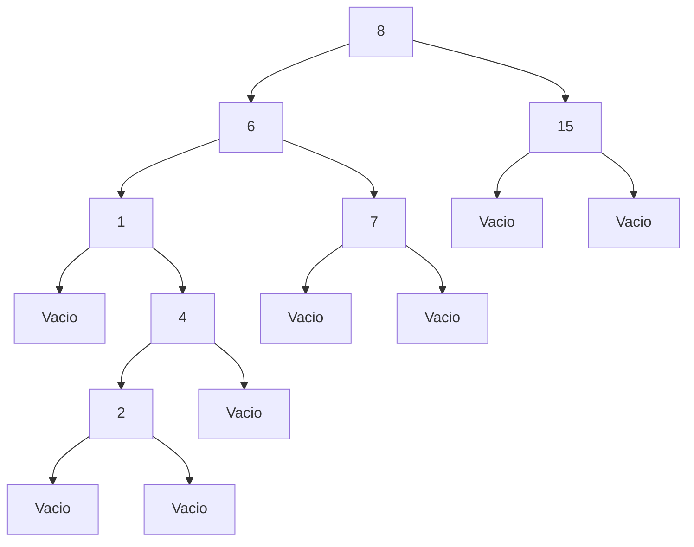

# Práctica 6 – Árboles Binarios

## Objetivo

Implementar funciones recursivas sobre árboles binarios en Haskell utilizando tipos algebraicos. Además, representar gráficamente árboles binarios mediante Mermaid, analizar recorridos y verificar propiedades como balanceo y construcción de árboles de búsqueda.

## Tiempo requerido

El tiempo estimado para completar esta práctica es de aproximadamente 3 a 4 horas, considerando la implementación de funciones, pruebas unitarias y documentación.

---

# Representaciones gráficas con Mermaid

## Árbol binario 1 (3 niveles)

## Árbol binario 2 (4 niveles)

---

# Árboles solicitados en la práctica

## a) AB 4 Vacio (AB 3 Vacio (AB 5 Vacio Vacio))

## b) AB 3 (AB 7 (AB 12 Vacio Vacio) Vacio) (AB 6 (AB 11 Vacio Vacio) (AB 10 Vacio Vacio))

## c) AB 8 (AB 6 (AB 1 Vacio (AB 4 (AB 2 Vacio Vacio) Vacio)) (AB 7 Vacio Vacio)) (AB 15 Vacio Vacio)

---

# Pregunta 7

### ¿El árbol resultante con foldl o foldr es un BST balanceado?

No necesariamente. El árbol generado depende del orden de los elementos en la lista. Si la lista está ordenada, el árbol resultante será degenerado y perderá el balance.

### ¿Cuál sería la idea para que foldr o foldl generen BST balanceados?

La idea es ordenar previamente la lista y seleccionar el elemento medio como raíz. Posteriormente se divide la lista en dos sublistas (izquierda y derecha) y se repite el proceso recursivamente.

### Ventajas de foldl sobre foldr

* Procesa la lista de izquierda a derecha.
* Es más eficiente con evaluación estricta.
* Funciona mejor para acumuladores grandes.

### Ventajas de foldr sobre foldl

* Permite trabajar con evaluación perezosa.
* Funciona con listas infinitas.
* Es útil para construir estructuras recursivas.

---

# Comentarios adicionales

Todas las funciones fueron implementadas de forma recursiva sin utilizar `foldl`, `foldr`, `maximum` o `minimum`, siguiendo los lineamientos de la práctica. Se incluyen pruebas unitarias con HUnit para validar el comportamiento esperado.

