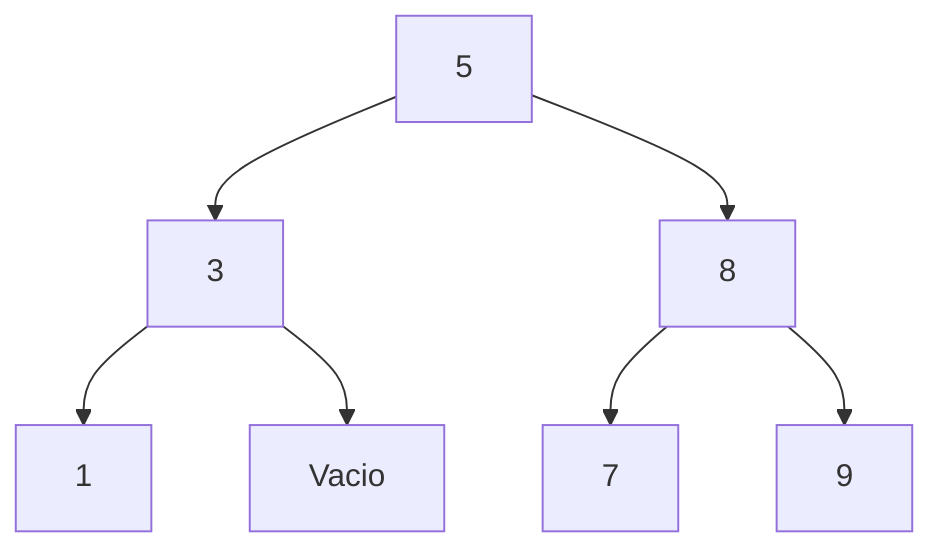
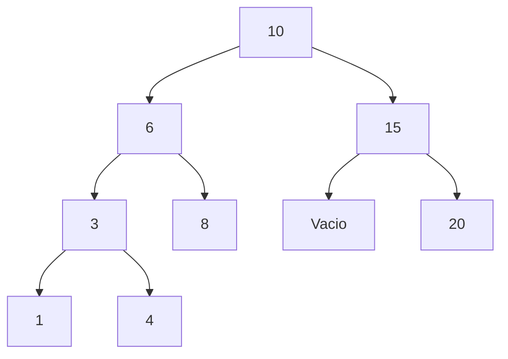
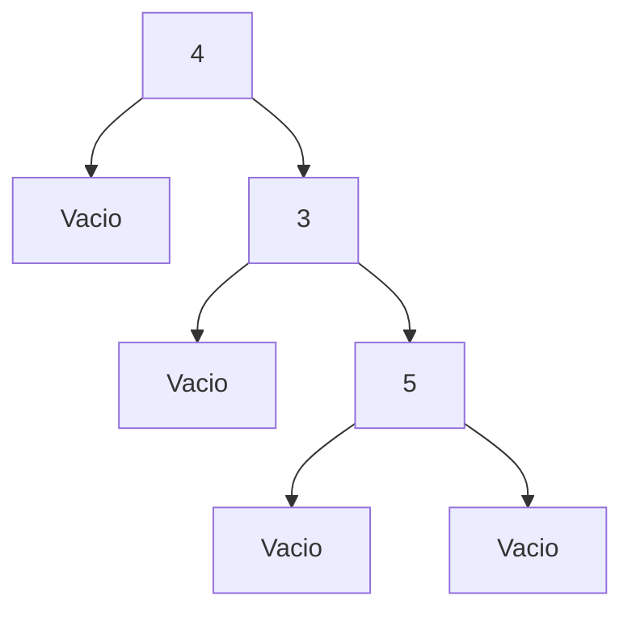
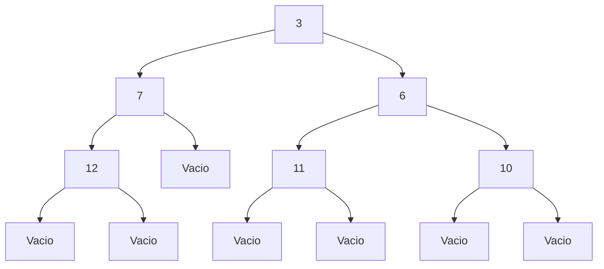
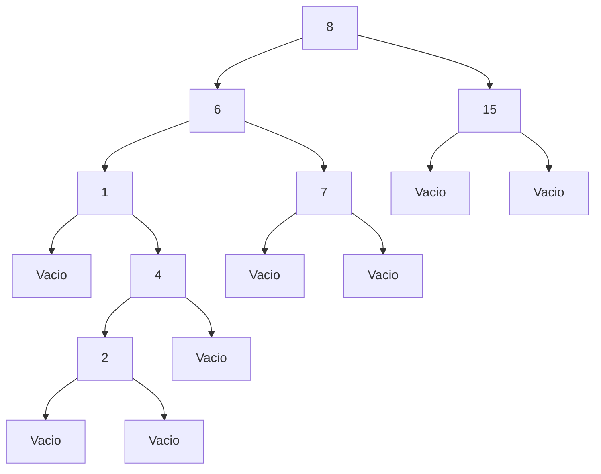

# Práctica 6 - Árboles Binarios

**Nombre:** María Fernanda Barrios Vega
**Materia:** Estructuras Discretas
**Semestre:** 2026-I

## Objetivo

El objetivo de esta práctica es implementar funciones recursivas sobre árboles binarios utilizando tipos de datos algebraicos en Haskell. También se busca representar visualmente árboles binarios mediante la herramienta Mermaid.

## Tiempo requerido

Aproximadamente 4 horas.

---

# Representaciones Gráficas

## Árbol 1 (3 niveles)

## Árbol 2 (4 niveles)

---

# Árboles solicitados

## a) AB 4 Vacio (AB 3 Vacio (AB 5 Vacio Vacio))

## b) AB 3 (AB 7 (AB 12 Vacio Vacio) Vacio) (AB 6 (AB 11 Vacio Vacio) (AB 10 Vacio Vacio))

## c) AB 8 (AB 6 (AB 1 Vacio (AB 4 (AB 2 Vacio Vacio) Vacio)) (AB 7 Vacio Vacio)) (AB 15 Vacio Vacio)

---

# Preguntas Teóricas

### ¿El árbol resultante con foldl o foldr es balanceado?

No necesariamente. El árbol generado depende del orden de inserción y puede quedar desbalanceado.

### ¿Cómo hacer que foldl o foldr generen árboles balanceados?

Ordenando la lista previamente y tomando el elemento medio como raíz para dividir recursivamente.

### Ventajas de foldl

* Evalúa de izquierda a derecha
* Puede ser más eficiente con acumuladores
* Útil para listas grandes con evaluación estricta

### Ventajas de foldr

* Permite trabajar con listas infinitas
* Funciona mejor con evaluación perezosa
* Útil cuando se construyen estructuras recursivas

---

# Conclusión

En esta práctica se implementaron funciones recursivas sobre árboles binarios y se analizaron distintas formas de recorrido y balanceo. También se utilizó Mermaid para visualizar estructuras arbóreas, facilitando la comprensión de su organización.
